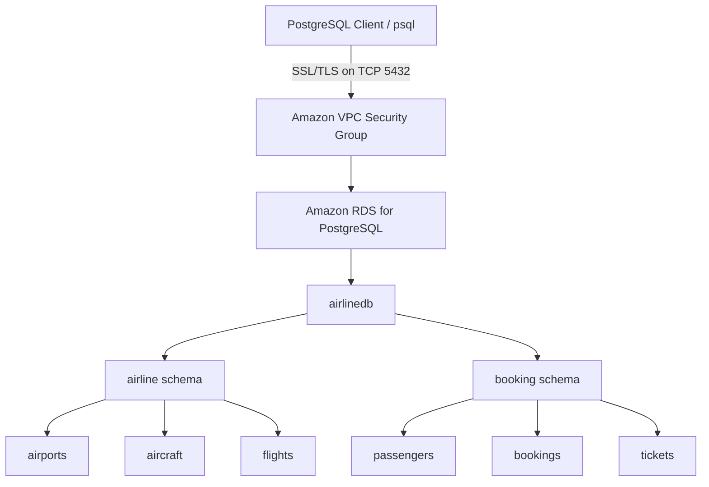
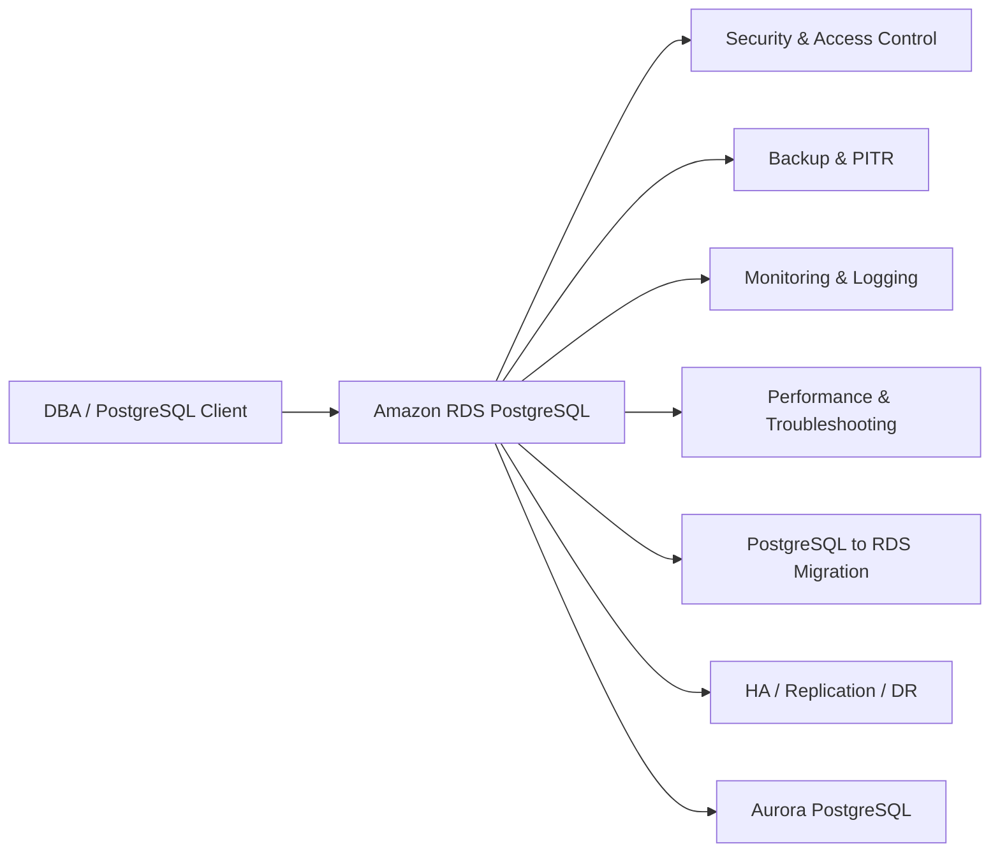

# Airline Operations Database – AWS RDS PostgreSQL

> **PostgreSQL DBA implementation on Amazon RDS, using a structured airline operations database.**

## Project Overview

This project focuses on practical PostgreSQL database administration on **Amazon RDS for PostgreSQL**.

The implementation covers database operations from initial RDS configuration through administration, security, backup and recovery, monitoring, performance, migration, high availability, replication, disaster recovery, and Aurora PostgreSQL evaluation.

The project is designed as a structured, professionally documented DBA implementation with a clear progression from core RDS administration to advanced AWS database capabilities.

## Core Technologies

- **Database:** PostgreSQL
- **Cloud Database:** Amazon RDS for PostgreSQL
- **Client:** PostgreSQL `psql`
- **Connectivity:** SSL/TLS
- **Cloud Platform:** Amazon Web Services (AWS)
- **Operating System for self-managed comparison:** Rocky Linux
- **Local administration environment:** Windows + PostgreSQL client tools

## Current RDS Environment

| Component | Current Configuration |
|---|---|
| AWS Service | Amazon RDS for PostgreSQL |
| PostgreSQL Version | 18.3 |
| DB Instance Class | `db.t4g.micro` |
| Deployment | Single-AZ |
| Storage | 20 GiB General Purpose SSD |
| Database | `mydb` / `airlinedb` |
| PostgreSQL Port | `5432` |
| Public Access | Enabled |
| Encryption | Enabled |
| Automated Backup Retention | 1 day |
| SSL/TLS | Enabled and verified with `verify-full` |

> Sensitive environment details such as account identifiers, IP addresses, security group IDs, database passwords, and RDS endpoints are intentionally excluded from this repository.

## Project Architecture

### Current Architecture



### Project Scope Architecture



The second diagram represents the technical areas covered by the project roadmap; resources are not assumed to be deployed unless shown as completed in the project status.

## Project Progress

| Area | Status |
|---|---|
| RDS Architecture & Connectivity | ✅ Completed |
| SSL/TLS Connectivity & Validation | ✅ Completed |
| Database & Schema Design | ✅ Completed |
| Relational Table & Foreign-Key Validation | ✅ Completed |
| Users, Roles & Security | ⏳ Planned |
| RDS Parameter Groups | ⏳ Planned |
| Automated Backups & Snapshots | ⏳ Planned |
| Restore & Point-in-Time Recovery | ⏳ Planned |
| Monitoring & Logging | ⏳ Planned |
| Performance Tuning | ⏳ Planned |
| Sessions, Locks & Troubleshooting | ⏳ Planned |
| Storage & Capacity Management | ⏳ Planned |
| Maintenance & Engine Upgrades | ⏳ Planned |
| VMware PostgreSQL → RDS Migration | ⏳ Planned |
| High Availability / Multi-AZ | ⏳ Planned |
| Read Replication | ⏳ Planned |
| Disaster Recovery | ⏳ Planned |
| Aurora PostgreSQL | ⏳ Planned |

## DBA Areas Covered

### Amazon RDS Administration

- RDS instance configuration and connectivity
- VPC, subnet, security group, and endpoint concepts
- SSL/TLS database connectivity
- PostgreSQL database and schema administration
- Users, roles, privileges, and least-privilege access
- RDS parameter groups
- Automated backups and manual snapshots
- Point-in-time recovery and restore workflows
- Monitoring and database logging
- Sessions, locks, and troubleshooting
- Query analysis and performance tuning
- Storage and capacity management
- Maintenance and engine version management
- High availability and replication concepts
- Disaster recovery planning

### PostgreSQL Administration

The project also applies core PostgreSQL administration practices including:

- SQL administration
- Schema and object management
- Role and privilege management
- Foreign keys and relational integrity
- Query analysis
- Backup and recovery concepts
- Monitoring and troubleshooting
- Replication concepts

## Self-Managed PostgreSQL and Amazon RDS

The project connects traditional PostgreSQL administration with AWS-managed database operations.

| Self-Managed PostgreSQL | Amazon RDS for PostgreSQL |
|---|---|
| `postgresql.conf` | DB parameter groups |
| OS/network firewall | VPC security groups |
| Manual backup configuration | Automated backups and snapshots |
| Filesystem and OS management | AWS-managed infrastructure |
| Manual maintenance and patching | AWS-managed maintenance capabilities |
| OS/database monitoring | RDS and AWS monitoring capabilities |

The detailed comparison is documented within the relevant implementation areas rather than duplicated throughout the repository.

## Documentation Approach

Each implementation area is documented with a consistent technical format:

- **Objective**
- **Architecture / Configuration**
- **Implementation Steps**
- **Commands**
- **Validation**
- **Observed Results**
- **DBA Notes**
- **Troubleshooting**
- **Cost Considerations**
- **Cleanup**

Only commands, outputs, measurements, and observations actually performed during the implementation are documented. No fabricated production metrics or business results are used.

## Cost-Conscious Infrastructure Approach

The project follows a cost-conscious AWS infrastructure approach:

- Reuse existing resources where practical.
- Avoid unnecessary database instances and supporting infrastructure.
- Keep resource sizes appropriate for the implementation.
- Review potentially chargeable features before enabling them.
- Clean up temporary resources after controlled activities.
- Separate core administration work from resource-intensive HA, replication, and multi-instance scenarios.

## Project Structure

```text
AWS-RDS-PostgreSQL-Airline-DBA-Project/
│
├── README.md
│
├── 01-rds-architecture-connectivity/
│   ├── README.md
│   ├── commands.md
│   └── commands-with-output.md
│
├── 02-airline-database-design/
│   ├── README.md
│   ├── commands.md
│   ├── commands-with-output.md
│   └── airline-schema.sql
│
├── 03-users-roles-security/
├── 04-rds-parameter-groups/
├── 05-backup-snapshots/
├── 06-restore-pitr/
├── 07-monitoring-logging/
├── 08-performance-tuning/
├── 09-sessions-locks-troubleshooting/
├── 10-storage-capacity/
├── 11-maintenance-upgrades/
├── 12-postgresql-to-rds-migration/
├── 13-high-availability-replication/
├── 14-disaster-recovery/
└── 15-aurora-postgresql/
```

## Roadmap

The project progresses through the following major stages:

**RDS Core Administration**  
Architecture → Connectivity → Security → Database Administration → Parameter Groups → Backup & Recovery → Monitoring

**RDS Deep-Dive Administration**  
Performance → Sessions & Locks → Storage → Maintenance → Upgrades

**Migration**  
Self-managed PostgreSQL on Rocky Linux → Amazon RDS PostgreSQL → Validation

**High Availability & Resilience**  
Multi-AZ → Read Replicas → Replication → Disaster Recovery

**Aurora PostgreSQL**  
Aurora Architecture → Availability → Scaling → RDS vs Aurora comparison

## Official References

- [Amazon RDS for PostgreSQL User Guide](https://docs.aws.amazon.com/AmazonRDS/latest/UserGuide/CHAP_PostgreSQL.html)
- [Common management tasks for Amazon RDS for PostgreSQL](https://docs.aws.amazon.com/AmazonRDS/latest/UserGuide/CHAP_PostgreSQL.CommonTasks.html)
- [Amazon RDS backup and recovery](https://docs.aws.amazon.com/AmazonRDS/latest/UserGuide/USER_WorkingWithAutomatedBackups.html)
- [Amazon RDS PostgreSQL read replicas](https://docs.aws.amazon.com/AmazonRDS/latest/UserGuide/USER_PostgreSQL.Replication.ReadReplicas.html)

## Author

**Mohamed Hasim Badhusha S.**  
PostgreSQL DBA | Database Reliability Engineer

- [LinkedIn](https://www.linkedin.com/in/mohamed-hasim-badhusha-s-ab386a35a/)
- [GitHub](https://github.com/hasimmohamed10-art)
